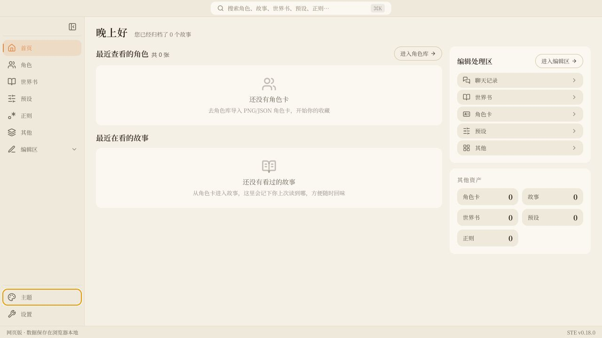
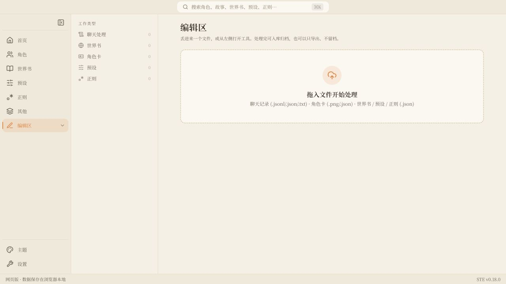
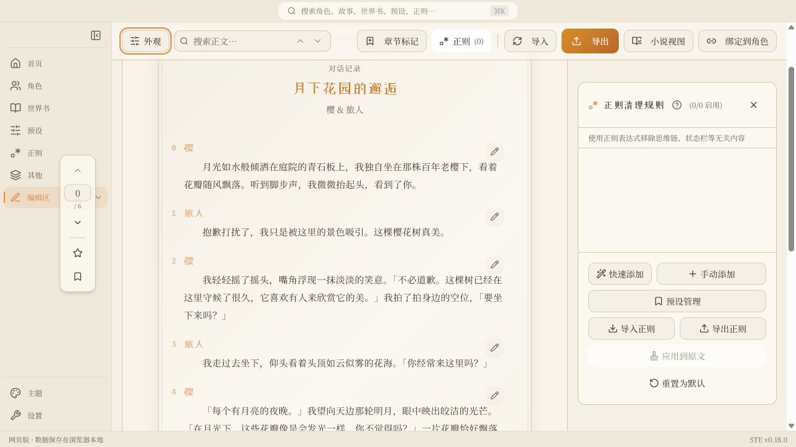
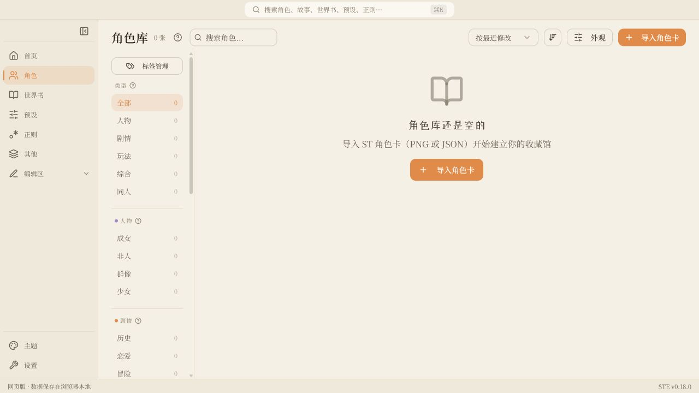
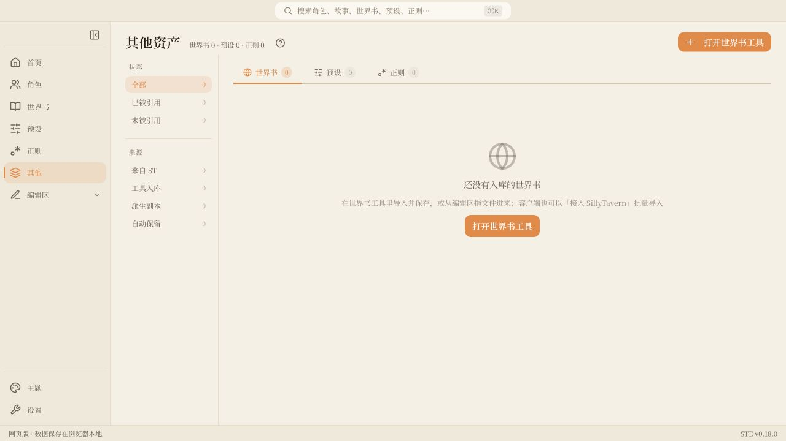
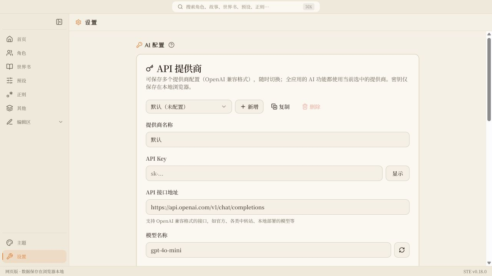

<h1 align="center">ST Explorer</h1>

<p align="center">SillyTavern 角色卡与聊天记录的本地归档工作台</p>

<p align="center">
  
  
  
  
</p>

> **数据不出本机。** 角色、故事、世界书、预设、正则、总结、故事树全部保存在本地——网页版存在浏览器 IndexedDB，客户端存在你指定的文件库目录（明文文件，可直接用资源管理器查看）。只有你主动使用 AI 功能时，才会把当前选中的内容发送到**你自己配置**的 OpenAI 兼容接口；API Key 也只保存在本地（明文，同源脚本可读，不等于加密），请确保接口地址与密钥来自同一个可信提供商。

## 这是什么

玩 SillyTavern 会积累一堆散落的资料：几十个角色卡 PNG、越来越长的聊天记录、改了又改的世界书和预设。ST Explorer 把这些收进一个可以翻阅的地方——

```text
接入 SillyTavern ──▶ 角色库（卡 / 标签 / 评分）
                        │
                        └──▶ 角色名下的故事
                               ├── 阅读与编辑（楼层 / 正则 / 分章 / 小说视图）
                               ├── 整理与记录（总结 / 日记 / 故事树）
                               └── 导入与导出（TXT / JSONL / Obsidian / 写回 ST）
```

它不替代 SillyTavern，也不参与对话生成。它做的是玩完之后的事：把这次游玩留下的东西读完、整理好、留下来，需要时再导回 ST 继续玩。

## 亮点

- **角色为中心的归档结构**：角色卡是索引，聊天记录是这个角色名下的故事，世界书 / 预设 / 正则是可以跨角色复用的资产。
- **与 SillyTavern 双向互通**：角色卡（PNG tEXt 回写，保留原立绘）、聊天 JSONL、世界书、Chat Completion 预设、正则脚本——导入解析未识别字段原样保留，导出可直接放回 ST。
- **客户端直连 ST 目录**：选定 `data/default-user` 后可扫描导入，编辑完写回原文件，写回前自动备份并保留历史版本。
- **本地优先，无账号无服务端**：网页版用 IndexedDB，客户端用明文文件库；整库备份可一键导出成一个 JSON 文件。
- **长记录也能读**：阅读区虚拟化渲染，几百楼、几十万字照样秒开；配翻页式小说视图、楼层跳转、收藏与全文搜索。
- **AI 是可选增强**：总结、角色日记、故事树、世界书追加、提示词改写都走你自己的 OpenAI 兼容提供商；不配也能用全部基础功能。
- **四套主题**：深咖啡（默认）、墨黑、深夜蓝、米色典雅，客户端为无边框窗口。

## 架构

```text
┌──────────────────────────────────────────────────────┐
│                ST Explorer (React SPA)               │
│      Home / Library / Editor / Assets / Settings     │
└───────────────────────────┬──────────────────────────┘
                            │ createRepo（同一套仓库接口）
             ┌──────────────┴──────────────┐
             ▼                             ▼
┌────────────────────────┐    ┌────────────────────────┐
│  Web: IndexedDB        │    │  Desktop: Vault (files)│
└────────────────────────┘    └────────────┬───────────┘
                                           │ Tauri command（路径授权）
                                           ▼
                              ┌────────────────────────┐
                              │  Rust file layer       │
                              └────────────┬───────────┘
                                           │ 扫描导入 / 写回 + 备份
                                           ▼
                              ┌────────────────────────┐
                              │  SillyTavern data/     │
                              └────────────────────────┘
```

同一套前端跑两种形态：数据层通过统一的仓库接口切换，网页版落在 IndexedDB，客户端落在明文文件库。只有客户端拥有原生文件层——Rust 侧把可访问路径限制在已授权的文件库、ST 根与导出目录，前端传入的任意路径不被信任。AI 请求由前端直接发往你配置的接口，不经过任何中间服务器。

## 界面一览








## 快速开始

需要 [Node.js](https://nodejs.org/) 18 或更新版本（CI 在 Node 22 上验证）。

### 网页版

```sh
git clone https://github.com/LYC619/silly-tavern-explorer.git
cd silly-tavern-explorer
npm install
npm run dev
```

浏览器打开 `http://localhost:8080`。Windows 用户也可以直接双击 `start.bat`（自动装依赖、构建并起预览服务，地址 `http://localhost:4173`）。

### 客户端（Windows）

客户端需要额外的 [Rust 工具链](https://www.rust-lang.org/tools/install)；WebView2 在 Windows 11 已内置，Windows 10 需自行安装运行时。

```sh
npm install
npm run tauri:dev      # 开发模式，前端热更新
npm run tauri:build    # 出安装包
```

安装包产物在 `src-tauri/target/release/bundle/nsis/`。开发模式也可以双击 `tauri-dev.bat`。

> 自行构建的 exe 没有代码签名，首次运行会被 Windows SmartScreen 拦一次（更多信息 → 仍要运行）。目前尚未发布预编译安装包。

### 第一次用

1. **客户端**：首次启动先选一个空目录作为 STE 文件库——之后所有数据都明文存在这里。**网页版**跳过这步，数据存在浏览器里。
2. 想搬 SillyTavern 的现有资料，去「设置」指定 ST 的 `data/default-user` 目录，扫描后勾选要导入的角色、聊天、世界书、预设和正则；也支持导入 ST 备份 ZIP。
3. 只想处理单个文件，就把 `.jsonl` / `.json` / `.txt` / `.png` 拖进「编辑区」，应用会判断类型并送进对应工具。
4. 聊天记录处理完可以导出 JSONL（回 ST 继续玩）或 TXT（归档阅读），也可以「绑定到角色」，升级成角色名下的故事长期整理。

## 功能详解

### 首页

回到最近工作的地方：最近查看的角色与故事、按文件类型分流的处理入口、其他资产统计、全局搜索。左侧一级导航分首页 / 角色库 / 编辑区 / 附属库四区，底部是文件库、主题与设置。

### 角色库与角色页

- 导入 SillyTavern 角色卡 PNG / JSON，自动识别 V1 / V2 / V3（同时含 V2/V3 时优先 V3）；普通图片可转成空白卡当占位。
- 类型单选 + 其余标签组多选；标签可自建一级/二级分类并拖拽排序，支持隐藏零使用标签。
- 网格视图可按类型 / 评分 / 最后更新 / 一级标签分组；列表视图有置顶表头对齐各列。
- 搜索同时匹配原名与展示名；跨页批量选择、Shift 范围选择、批量打标签 / 导出 / 删除，删除确认会列出角色名。
- 评分支持手动、模板加权与 AI 三种方式；NSFW 图片默认模糊，角色页可在当前会话点击揭示。
- 角色页汇总简介（可 AI 生成并保留版本历史）、评分、名下故事、关联资产与立绘，支持就地阅读（只读）。
- 删除角色只删 STE 内的档案，名下故事转为未绑定，不会连带删除。

### 故事工作区

每个故事有三个分区：

- **阅读与编辑**：虚拟化楼层预览、每楼铅笔就地编辑、删除/编辑撤销、章节标记、正则清理与「应用到原文」、左侧楼层跳转条（0-based，对齐 ST）、收藏楼层、全文搜索；翻页式小说视图支持双页、方向键与书签映射。
- **整理与记录**：总结（分卷 / 角色日记 / DIY 自由提示词，跨卷带前情、可挂预设与世界书、带 token 估算）、小总结（纯正则提取每楼自带小结）、故事树（可视化事实树，AI 从楼层提炼增量操作，四种视图 + 拖拽 + 撤销重做 + 导图导出 PNG/SVG）。记录区分主线与分支归属。
- **导入与导出**：TXT（带归档信息头与章节头）、JSONL（ST 兼容，按当前隐藏状态回写 `is_system`）、Obsidian Markdown（带 frontmatter）、分享长图；客户端可写回 ST 原文件，写回前备份并保留历史。

### 编辑区

不绑定角色也能单独用的工具：聊天处理、总结、故事树、世界书、角色卡、预设、正则。

- **世界书**：完整 SillyTavern World Info 字段编辑，卡片/列表双视图、置顶工具栏、分页（应对上千条）、搜索筛选排序、批量操作与 Shift 连选、前缀归类、快速创作模式；AI 可按当前聊天追加新条目或改写单条（改写先左右对照再替换）；显示单条与合计 token。
- **预设**：Chat Completion 预设可视化编辑——拖拽重排激活顺序、启用/禁用、提示词库、新建普通块与注入块（对齐 ST 绝对注入）、实时预览、多角色组切换、工具字段、内嵌正则；完整 / 智能 / 分组 / Markdown 四种导出，未识别字段无损 round-trip，附变更对比。
- **角色卡**：编辑名称、描述、性格、场景、开场白、备选开场白、对话示例、系统提示等核心字段；PNG 导入的卡可导出 PNG（写回 tEXt，保留原立绘，中文不乱码），JSON 导入的只能导出 JSON；内嵌世界书与正则可一键暂存成独立资产。
- **正则**：傻瓜式快速添加（开始/结束标签、首尾删除、内容替换）、实时预览、按用户/助手分别应用；与 ST 正则脚本双向互通，ST 独有字段无损保留。

### 附属库

世界书、预设、正则规则集与其他 ST 归档资产的收藏馆。列出来源、被哪些角色引用、STE 修改时间与源文件时间。共享资产在角色上下文里编辑时会走写时复制派生副本，不影响引用它的其他角色。

### AI 配置

设置页可保存多个 OpenAI 兼容提供商（官方 API、中转站、本地 Ollama 兼容层等），支持新增 / 复制 / 重命名 / 删除与一键切换，全应用共用当前选中的那个。「测试连通」发一个小请求验证地址、密钥与模型并显示延迟；模型列表可从接口拉取（按提供商分别记忆）。

用到 AI 的地方：总结生成与微调、故事树从楼层提炼事实、世界书追加条目与单条改写、预设提示词块改写、角色简介与评分。全部按需调用，不配置也能正常使用其余功能。

## 客户端与网页版的差异

| | 客户端（Tauri） | 网页版 |
|---|---|---|
| 数据存放 | 你指定的文件库目录，明文文件 | 浏览器 IndexedDB |
| 接入 ST | 直连 `data/default-user`，扫描导入 | 手动拖文件 / 导入备份 ZIP |
| 写回 ST | 支持，写回前自动备份并留历史 | 不支持，只能导出后手动放回 |
| 导出保存 | 系统原生保存对话框 | 浏览器下载 |
| 角色立绘 | 支持 | 不显示 |
| 窗口 | 无边框，最小 1024×700 | 跟随浏览器 |

## 数据、备份与隐私

- **整库备份**：设置页一键导出全部角色、故事、世界书、预设、正则、总结与故事树为一个 JSON 文件。
- **恢复先预览**：导入备份前逐类列出新增 / 覆盖 / 跳过的条数，确认后写入；七类数据在同一个事务里写，任一条失败整体回滚，不会留下半写状态。
- **文件校验**：导入依次校验扩展名、大小上限（500MB）、JSON 语法（报错定位到行列）与结构。
- **写回备份**：客户端写回 ST 前自动备份，普通写回保留 5 版、恢复前的保护备份保留 3 版，两池互不挤占。
- **临时缓存自救**：切页后内容异常时可「清除临时缓存」，只清页面间临时编辑态，已保存数据不受影响。
- API Key 只存本地；客户端会额外镜像到系统配置目录，避免文件库放在网盘时被同步出去。读取 ST 配置时只读模型与接口信息，不读密钥。

## 技术栈

React 18 · TypeScript（strict）· Vite 5 · Tailwind CSS 3 · shadcn/ui · Radix UI · IndexedDB · Tauri 2（Rust）

质量门禁：ESLint、`tsc -p tsconfig.app.json --noEmit`、Vitest、生产构建，CI 在 push 时跑全套。

```sh
npm test                                  # Vitest
npx tsc -p tsconfig.app.json --noEmit     # 类型检查（裸 tsc --noEmit 是空转）
npm run lint
```

## 网页版部署

### Vercel

[](https://vercel.com/new/clone?repository-url=https://github.com/LYC619/silly-tavern-explorer)

### Docker

```sh
docker build -t st-explorer .
docker run -d -p 8080:80 st-explorer
```

访问 `http://localhost:8080`。

## 独立轻量版

[`public/minimal.html`](./public/minimal.html) 是一个单文件工具，下载双击即用，只做导入聊天记录、正则清理、导出 TXT/JSONL 三件事。它是早期版本的产物，不随主应用更新，适合临时应急。

## 文档

- [更新日志](./CHANGELOG.md)
- [界面约定](./docs/ui-conventions.md)
- [处理原则](./docs/principles/)

## 许可

[AGPL-3.0-only](./LICENSE)。可以自由使用、修改、分发；但修改后若拿去提供网络服务，改动后的源码同样要以 AGPL 开放给该服务的使用者。
