<p align="center">
  
</p>

# ST-Explore

> SillyTavern 角色卡与聊天记录的**归档 · 编辑**工具。

[](https://github.com/LYC619/st-explore/releases)
[](https://github.com/LYC619/st-explore)
[](https://github.com/LYC619/st-explore)
[](./LICENSE)

> 让更多人体会到AIRP的乐趣。

---

## 📖 目录

- [项目简介](#-项目简介)
- [功能详解](#-功能详解)
- [快速开始](#-快速开始)
- [技术栈](#-技术栈)
- [路线图](#-路线图)
- [License](#-license)

---

## 🌟 项目简介

ST-Explore （拾忆）定位为 SillyTavern 用户的**离线归档与二次编辑工具**，只做两件事：

**归档** —— 把散落在 `data/default-user` 目录下的角色卡、聊天存档、世界书、预设、正则等资源集中呈现。以角色卡为中心，附上评分、游玩时长、字数统计、标签体系、封面网格等元数据，方便回顾和查找。

**编辑处理** —— 从 SillyTavern 导出聊天记录后，在此进行离线的批量编辑：楼层筛选、正则清洗、瘦身导出，以及基于 LLM 的分卷总结、角色日记、故事树生成等衍生操作。产物可再导入回 SillyTavern，或以 JSONL / JSON / TXT / Markdown 等格式导出。


---

## 📚 功能详解

### 0. 全局

- 🎨 支持四种主题切换
- 🔍 支持全局搜索（`Ctrl + F`）

#### 设置

##### 显示

隐藏 NSFW 卡面功能，列表和详情将默认对被标记的卡面进行模糊处理。

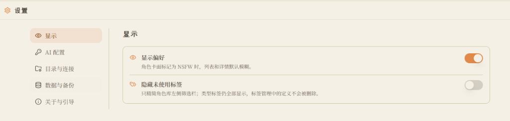

##### AI 配置

配置 OpenAI 兼容 API（也可接 Ollama 等本地服务），配置总结 / 日记 / 故事树等场景的提示词。

##### 目录与连接

可在这里重新扫描和导入 ST 目录，或者切换到另一个 ST 实例。

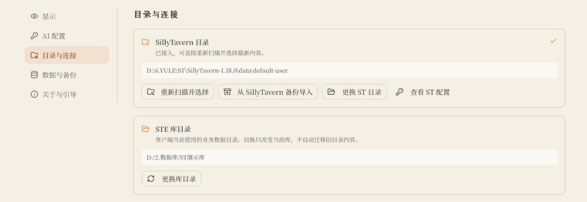

---

### 1. 首页


#### 基本介绍

首页是整个工作台的**仪表盘**，一屏内聚合四个区域：

- **左上角** 横向滚动展示最近查看的角色卡
- **左下角** 按时间线列出最近在看的故事及其楼数
- **右侧上半** 编辑处理区 —— 聊天处理、AI 总结、世界书、角色卡、预设五大工具的统一入口
- **右侧下半** 共享资产的全局概览，显示世界书、预设、正则的数量

#### 导入功能

桌面客户端首次启动时，顶部会出现「接入 SillyTavern」提醒。

- 指定 ST 的 `data/default-user` 目录后即可按类别批量导入角色、聊天、世界书、预设、正则与扩展资产
- 云酒馆可以通过一键备份或扩展功能导出压缩包再导入


**云酒馆导出位置：**

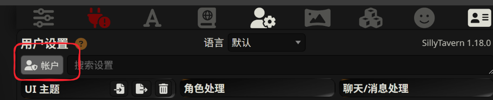
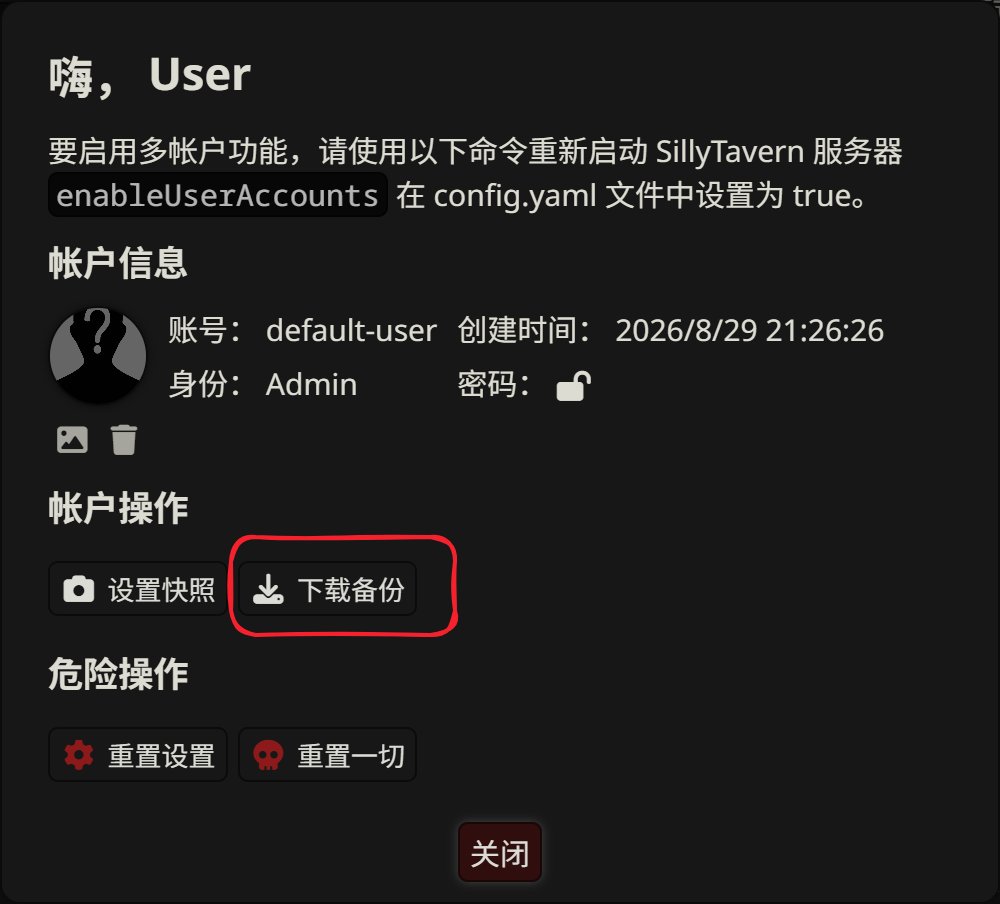

---

### 2. 角色库

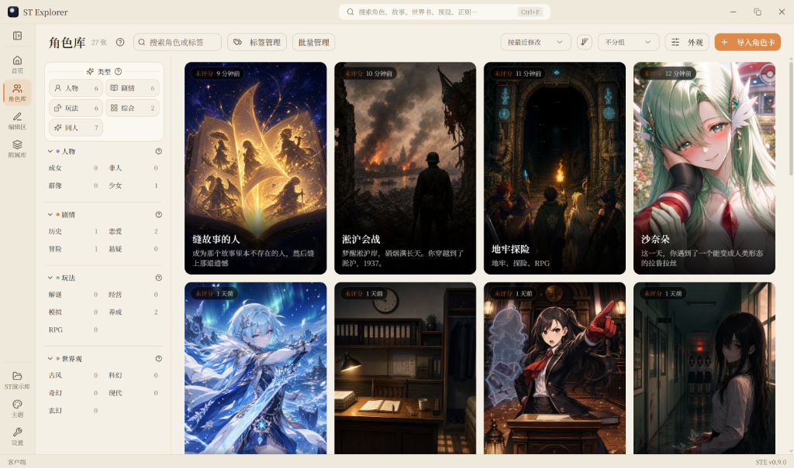

#### 基本介绍

角色库是所有角色卡的集中管理入口。

- **左侧面板** 为标签筛选区域，点击即可快速筛选
- **右侧** 以 2:3 比例封面网格展示角色卡，每张卡片显示评分、查看时间（可通过切换排序方式切换查看时间和最后一次对话时间）、简介摘要
- **顶部工具栏** 提供搜索、标签管理、批量管理、排序方式切换、分组模式和外观调整

#### 功能介绍

##### 导入

支持导入 SillyTavern 角色卡 PNG / JSON，自动识别 V1 / V2 / V3（同时含 V2/V3 时优先 V3）；普通图片可转成空白卡当占位。

##### 标签管理系统

- 类型单选 + 其余标签组可多选
- 标签可自建一级 / 二级分类并支持拖拽排序
- 左侧边栏支持拖拽调整大小
- 支持隐藏零使用标签

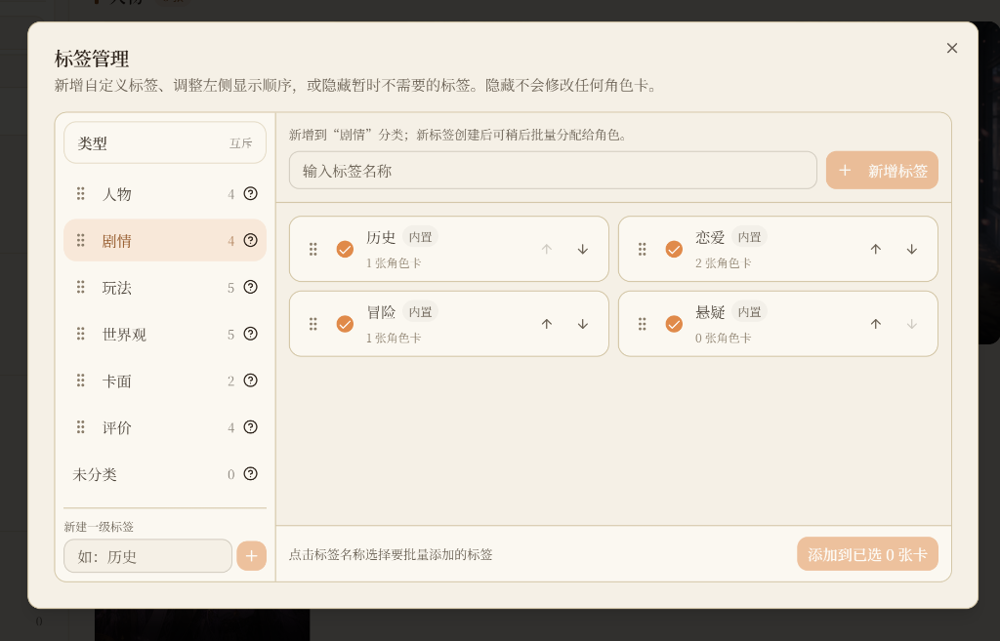

##### 展示与批量管理

| 项目 | 说明 |
| --- | --- |
| 卡面信息 | 角色卡名、介绍、左上角"评分 + 查看时间"、右上角"对话故事数" |
| NSFW 模糊 | 对被标记为 NSFW 的卡面自动做模糊处理 |
| 排序方式 | 按最近修改 / 按最近加入 / 按名称 / 按评分 / 按最后游玩，支持倒序 |
| 分组视图 | 按类型 / 按评分 / 按最后更新 / 按标签 |
| 外观 | 可调节卡片大小和字体大小，可切换列表视图 |
| 批量管理 | 支持批量加标签、删除、导出，Shift 范围选择 |


---

### 3. 角色详情页


#### 基本介绍

进入角色后展开完整的档案页面。

- **左侧信息栏** 显示卡面立绘、名称、类型、评分、游玩时长与字数统计
- **右侧顶部** 展示创作者信息与简介，支持 NSFW 标记和标签编辑
- **下方六个标签页：**

| Tab | 作用 |
| --- | --- |
| **故事** | 列出该角色下所有聊天存档，支持预览与正则清理 |
| **备注** | 记录玩卡心得，不写入角色卡文件 |
| **关联资产** | 展示绑定的世界书与预设等文件 |
| **立绘** | 管理多张角色图（支持替换时自动存档旧卡面）|
| **角色卡编辑** | 直接编辑角色卡的各个字段 |
| **开场白** | 查看和编辑首条消息与多版本候选开场白 |

#### 功能介绍

##### 故事

支持预览及正则清理，具体编辑功能到编辑区再介绍。小说视图目前只是半成品，计划后期尝试结合 agent 功能重构。

包含三个子界面：

- **总结**：对一段故事的总结，用于回顾之前剧情
- **日记**：以角色口吻写的日记，用于维持人设
- **故事树**：按人物、事件等类型进行拆分，方便总览剧情

##### 立绘功能


- 支持分行（分组）管理
- 支持预览
- 可替换当前卡面（旧卡面自动保存在"立绘 - 卡面"行）

---

### 4. 编辑区

编辑区是 ST-Explore 的核心工作台，聚合了聊天、总结、世界书、正则、预设等所有二次编辑能力。

#### 4.1 聊天处理

支持全文搜索、楼层跳转、楼层收藏、正则清理、手动编辑、瘦身导出等功能。

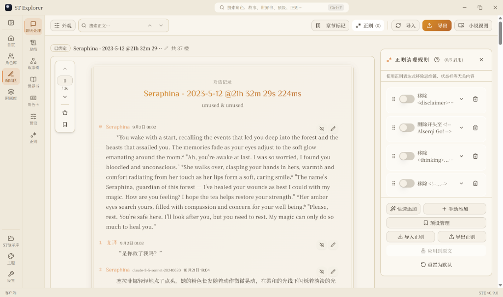

##### 导入与导出

**导入** 支持 JSONL / JSON / TXT，其中 TXT 模式需要自定义 user 和 assistant 名 / 将小说分段导入（试验功能，不保证可用性）。

**导出** 支持：

- 自定义楼层范围
- **精简导出**：只保留 `swipe_id` 指向的那条，丢掉其余候选，不影响后续游玩
- 多种格式（ST JSONL / 通用 JSON / 纯文本 TXT / Obsidian Markdown 等）

##### 外观

支持切换主题（典雅 / 小说 / 社交 / 简约）、字体、字号、宽度等；支持显示模型、时间戳。

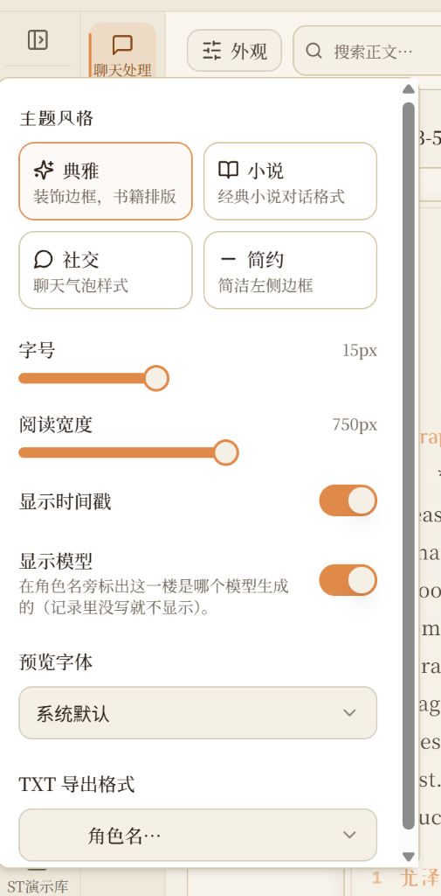

##### 正则

- 支持按类型快速生成正则
- 支持将正则直接应用于原文（即直接修改源文件，后续不再需要进行正则处理，可降低聊天文件体积）
- 支持导入、导出正则
- 支持将当前正则设置为预设

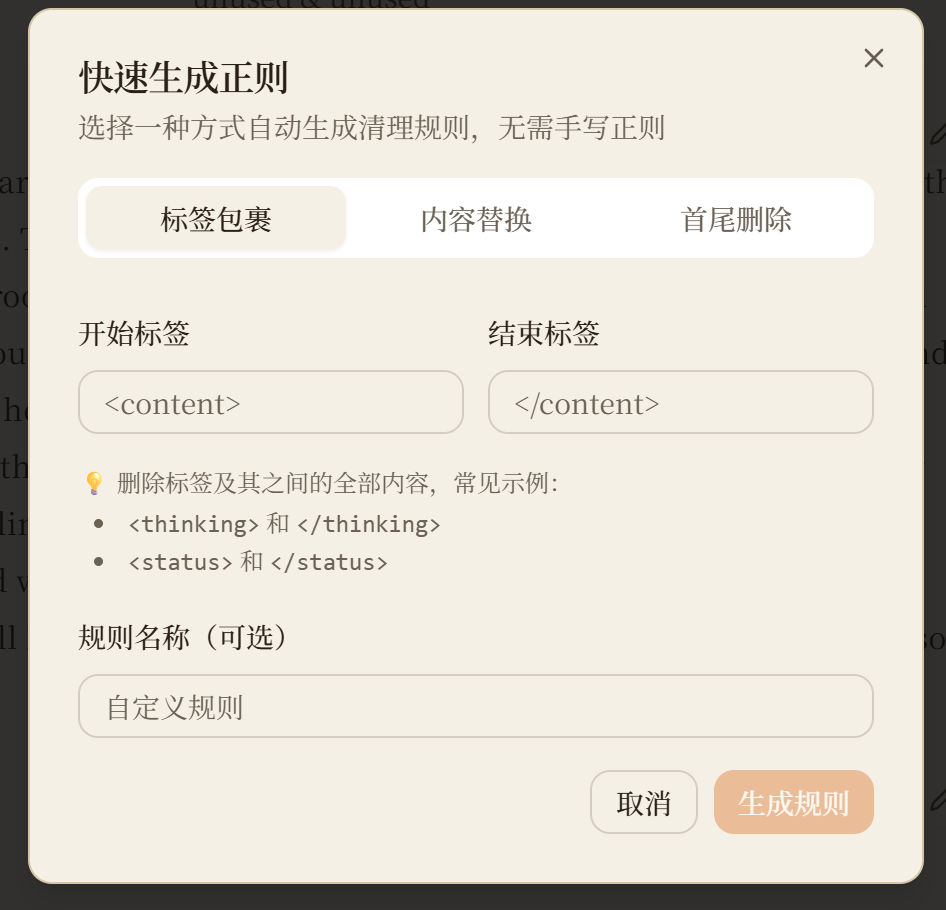

##### 其他

章节标记、小说视图属于**待开发功能**。

---

#### 4.2 总结相关功能

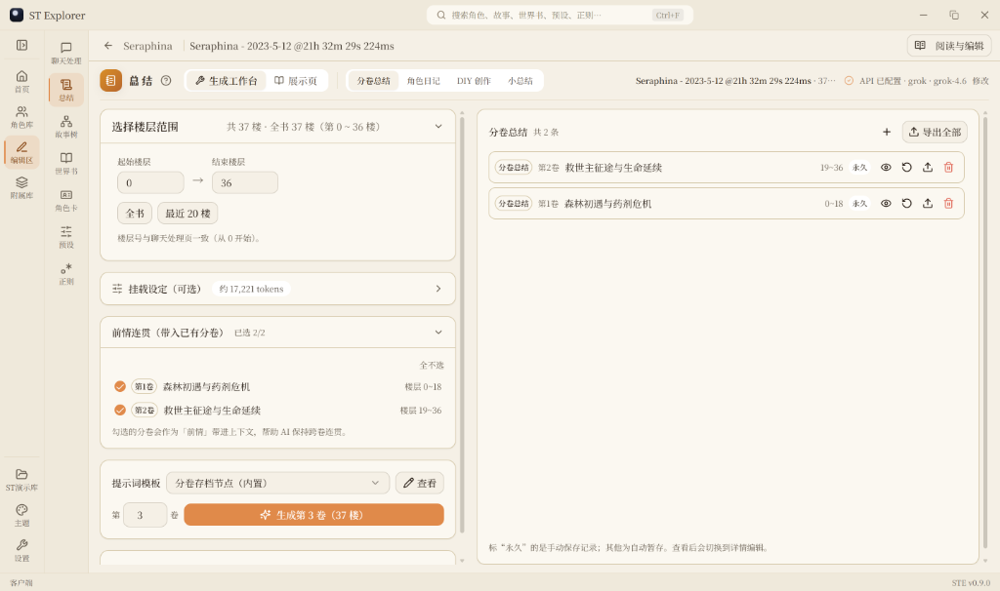

总结页面目前包括**总结、日记、DIY、小总结**等功能：

- ✅ 支持自定义楼层范围
- ✅ 支持挂载世界书 / 预设（目前挂预设比较麻烦，建议直接使用 grok 或 deepseek 等限制较弱的模型，基本不需要破限）
- ✅ 支持批量分段生成
- ✅ 小总结页是根据正则提取正文中的小总结部分，用于快速回忆剧情

展示页主要用来阅读生成的内容，后续可能针对这部分进行美化。

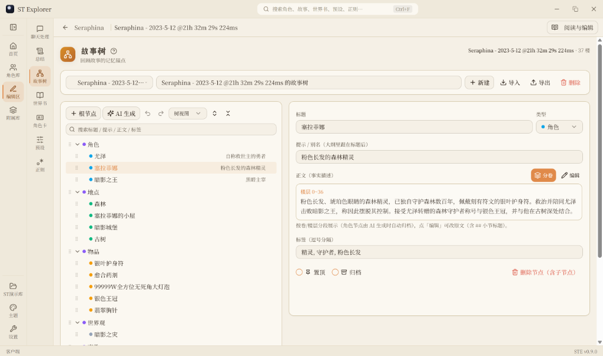

**故事树** 部分支持树视图、导图、卡片视图、时间轴视图，通过更清晰的架构回忆剧情。

这部分的提示词都支持自定义编辑，用户可以自己 DIY。因为目前有点关于 agent 的想法，所以关于 AI 的部分都没再精修，后续可能整体重构。

---

#### 4.3 世界书编辑器

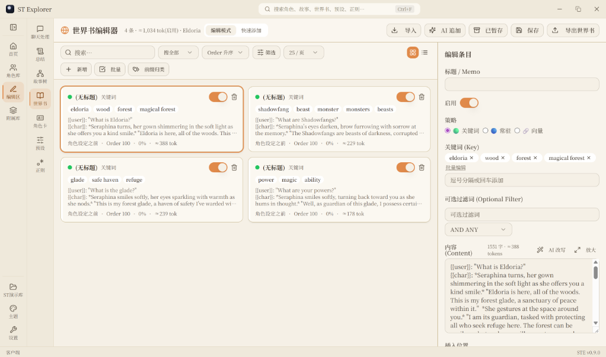

基本的世界书编辑功能就不多做介绍了。

**便捷阅览：** 将鼠标悬浮在条目上可显示内容，方便快速阅览。

**筛选与视图：** 支持搜索、按策略 / 状态 / 位置进行筛选，支持卡片视图、列表视图。

**批量操作：** 加前缀、更改位置、策略等。


**快速添加功能：** 通过空行划分条目，方便快速创建世界书。

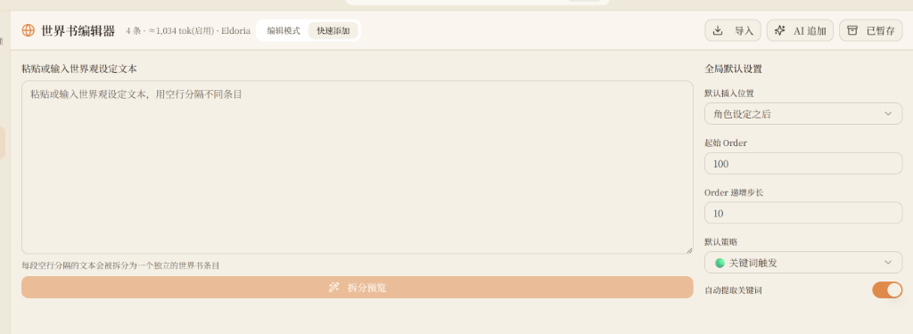

---

#### 4.4 其他功能

- **角色卡编辑** 已集成到角色详情页，不多做介绍；该界面仍保留是方便**不入库**的情况下对角色卡进行编辑
- **正则工具页** 用的也比较少，后续可能优化成"自定义前端美化"，这里不多做介绍

##### 预设编辑页

方便用户自己对预设进行 DIY。

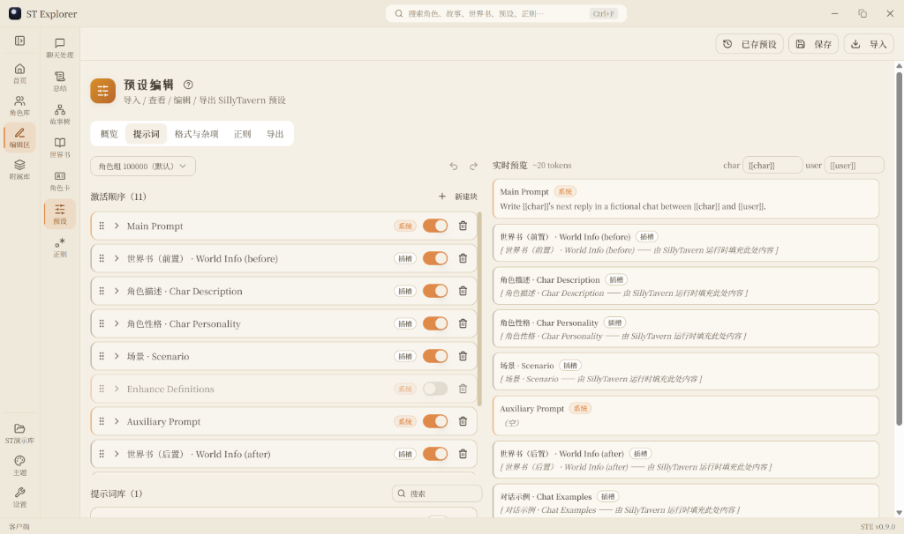

- 可对预设条目进行编辑，并**实时预览插入位置**
- 导出时可只导出当前分组预设 / 当前分组仅启用条目预设

---

### 5. 附属库

主要用于保存世界书、预设等资源，如图所示：

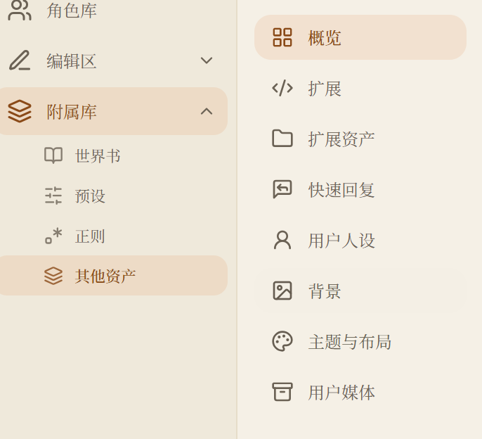

附属库把所有**可跨角色复用**的资源集中在一起管理：

| 子库 | 说明 |
| --- | --- |
| **世界书** | 全部世界书条目，可批量、可编辑 |
| **预设** | Chat Completion 预设，可分组管理 |
| **正则** | 全局正则清理规则，可导入导出 |
| **其他资产** | 扩展、扩展资产、快速回复、用户人设、背景、主题与布局、用户媒体 |

---

## 🚀 快速开始

### 环境要求

- [Node.js](https://nodejs.org/) ≥ 18（推荐 22）
- （桌面版额外需要）[Rust](https://www.rust-lang.org/tools/install)、WebView2（Windows 11 已内置）

### Web 版

```bash
git clone https://github.com/LYC619/st-explore.git
cd st-explore
npm install
npm run dev
```

打开 `http://localhost:8080` 即可访问。Windows 用户也可以直接运行仓库中的 `start.bat`（默认端口 `4173`）。

### 桌面版（Tauri，推荐）

```bash
npm install
npm run tauri:dev      # 开发模式
npm run tauri:build    # 打包安装包
```

打包产物在 `src-tauri/target/release/bundle/nsis/` 目录下。

> ⚠️ 首次运行未签名的 exe 时，Windows SmartScreen 可能会提示"未识别的应用"，选择"仍要运行"即可。

### 一键部署

| 方式 | 命令 / 链接 |
| --- | --- |
| Vercel | [](https://vercel.com/new/clone?repository-url=https://github.com/LYC619/st-explore) |
| Docker | `docker build -t st-explore . && docker run -d -p 8080:80 st-explore` |

### 首次使用建议

1. 打开程序，进入 **设置 → 目录与连接**
2. 指定 SillyTavern 的 `data/default-user` 目录，或从 ST 备份 ZIP 导入
3. 系统会自动扫描角色、聊天、世界书、预设、正则、扩展资产
4. 从"首页 → 编辑处理区"开始你的工作流

---

## 🛠 技术栈

- **前端**：React 18 + TypeScript（strict）+ Vite 5 + Tailwind CSS 3 + shadcn/ui + Radix UI
- **状态与持久化**：IndexedDB（Web 版）· Rust file layer（桌面版）
- **桌面壳**：Tauri 2（Rust）
- **测试与质量**：ESLint · `tsc --noEmit` · Vitest · CI on push

```bash
npm test                                # Vitest
npx tsc -p tsconfig.app.json --noEmit   # 类型检查
npm run lint                            # 代码检查
```

**架构一览**

```
┌──────────────────────────────────────────────────┐
│           ST-Explore (React SPA)                 │
│  Home / Library / Editor / Assets / Settings     │
└──────────────────────────────────────────────────┘
                     │ createRepo()
        ┌────────────┴─────────────┐
        ▼                          ▼
┌────────────────┐        ┌─────────────────────┐
│ Web: IndexedDB │        │ Desktop: Vault(fs)  │
└────────────────┘        └─────────────────────┘
                                   │ Tauri command
                                   ▼
                          ┌─────────────────────┐
                          │  Rust file layer    │
                          └─────────────────────┘
                                   │ 读/写
                                   ▼
                          ┌─────────────────────┐
                          │ SillyTavern data/   │
                          └─────────────────────┘
```

---

## 🗺 路线图

- [ ] 移动端适配（响应式布局）
- [ ] Agent 化改造（故事分析、剧情推进、总结工作流的自动编排）
- [ ] 界面美化（展示页阅读体验、正则工具页作为"自定义前端美化"重构）

欢迎在 [Issues](https://github.com/LYC619/st-explore/issues) 提出建议或 PR。

---

## 📄 License

[AGPL-3.0-only](./LICENSE)

本项目基于 AGPL-3.0 协议开源。SillyTavern 及其相关角色卡 / 预设 / 世界书的版权归各自作者所有，本项目仅作为**第三方管理工具**存在。
